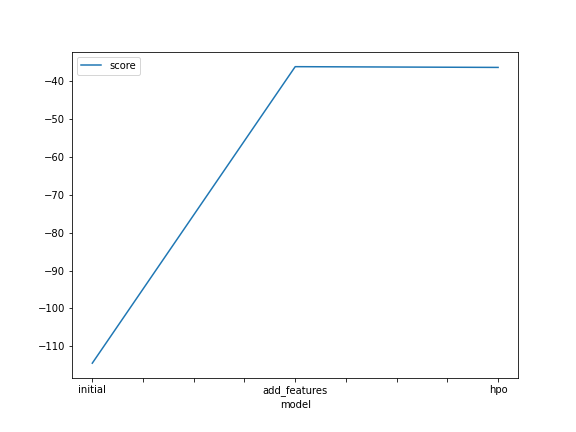
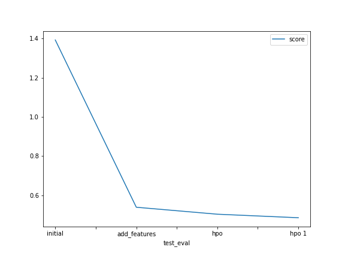

# Report: Predict Bike Sharing Demand with AutoGluon Solution
#### Martin Oywa

## Initial Training
### What did you realize when you tried to submit your predictions? What changes were needed to the output of the predictor to submit your results?
Submission would have failed unless all negative predictions got set to 0. So I first ran a describe on the predictions to confirm if there were
any negative values, which there were. Afterwards I counted how many they were, then set them to 0. 

### What was the top ranked model that performed?
WeightedEnseble model with L3 normalization genereally. This particular model was ranked 2nd when I did the feature engineering step, although it was only a difference of approxiamtely 0.1 as the top model had a score of of -36.043945, and it had -36.183579.

## Exploratory data analysis and feature creation
### What did the exploratory analysis find and how did you add additional features?
Creating histograms from the training data helped in identifying which features were more suited to be categorical features based on their distribution. Additional features were added from the datetime in the data. Only the hour was created as an additional feature.

### How much better did your model preform after adding additional features and why do you think that is?
The Kaggles Score dropped from 1.39222 to 0.53882, which was a great improvement. The new feature had rather small negative and positive correlations with
other features in the dataset, which probably means that it had new information that could prove meaningful to prediting the target.

## Hyper parameter tuning
### How much better did your model preform after trying different hyper parameters?
The model slightly degraded first after trying out different hyperparameters. Once I added hyperparameters for the Fast AI model, which seemed to be performing really well in the first two predictions, the overall performance increased.

### If you were given more time with this dataset, where do you think you would spend more time?
- Exploratory data analysis especially on visualization such as Scatter Plots and Histograms, and checking correlation between features.
- Feautre Engineering such as adding and removing features based on what I discover in EDA.
- Experimenting on different hyperparamter values. I would start with higher level ones, then more model specific.
- With every one of the above I would evaluate model preformance (base for the first two).

### Create a table with the models you ran, the hyperparameters modified, and the kaggle score.
|model|time limit|num epochs|learning rate|model types tuned|score|
|--|--|--|--|--|--|
|initial|600|default|default|None|1.39222|
|add_features|600|default|default|None|0.53882|
|hpo|180|10|Space [1e-4, 1e-2, 5e-4]|NN, GBM|0.50332|
|hpo 1|300|30|1e-2|NN, GBM, FASTAI|0.48530|

### Create a line plot showing the top model score for the three (or more) training runs during the project.

### Create a line plot showing the top kaggle score for the three (or more) prediction submissions during the project.

## Summary
This project was mainly to assess how perfoming EDA on a dataset can help identify what kind of Feature Engineering can be done on a dataset.
It also highlighted the concept of, choice of an evalutation metric can be determined by the kind of task you're performing. In this case we used
RMSE since this was a regression task. Another key concept was on interpretation of RMSE i.e the smaller the better, as long as you're not overfitting
on the training set.

Since the models I trained did not necessarily improve significantly with hyperparameter tunning, the project also highlighted that choice of hyperparaters
to change is a major determinant on whether the model will improve or degrade.